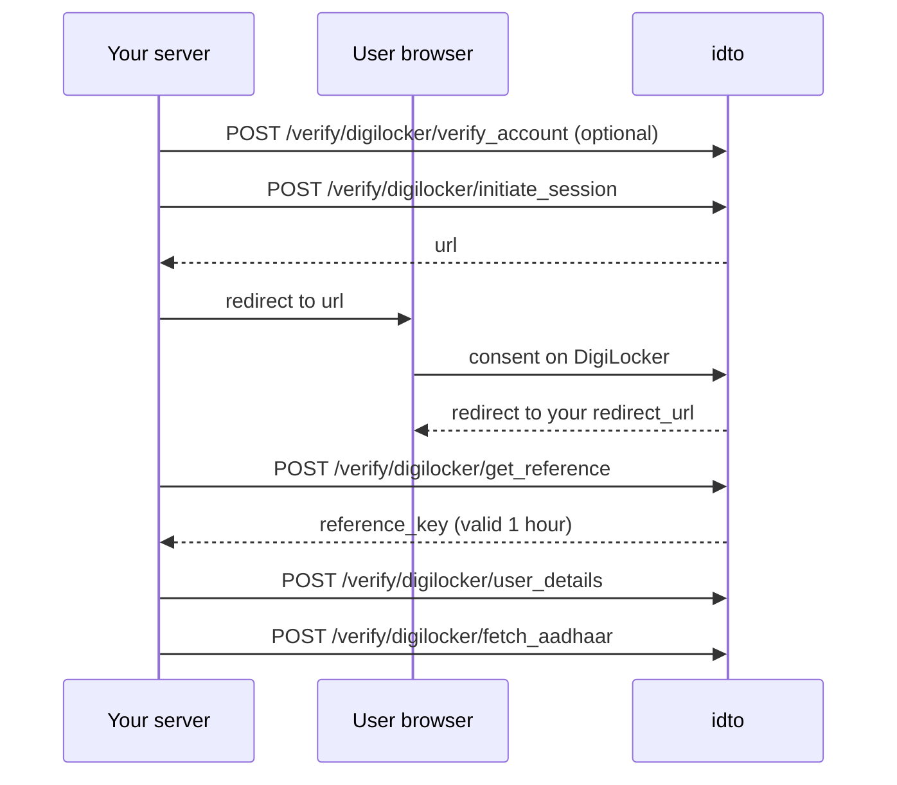

DigiLocker lets a user share government-issued records with you after they consent on the DigiLocker screen. idto hosts the consent step and the token exchange, so your server only makes five calls, all with your `X-Client-ID` and `X-API-Key`.



These are v1 endpoints: responses use the v1 shape, there is no `Idempotency-Key` support, and billing is signalled by `chargeble`. See [Migrate from v1](/migrate-from-v1).

<Steps>
  <Step title="Optional: check the user has a DigiLocker account">
    ```bash
    curl --request POST \
      --url https://dev.idto.ai/verify/digilocker/verify_account \
      --header "X-Client-ID: $IDTO_CLIENT_ID" \
      --header "X-API-Key: $IDTO_API_KEY" \
      --header "Content-Type: application/json" \
      --data '{"mobile_number": "9999999999"}'
    ```

    `result.registered` is `true` with `code` `1004` when the mobile number has an account, and `false` with `code` `2002` when it does not. Both come back with `status: "success"`. If there is no account, set `redirect_to_signup: true` in the next step so the user can create one.
  </Step>

  <Step title="Start a session">
    ```bash
    curl --request POST \
      --url https://dev.idto.ai/verify/digilocker/initiate_session \
      --header "X-Client-ID: $IDTO_CLIENT_ID" \
      --header "X-API-Key: $IDTO_API_KEY" \
      --header "Content-Type: application/json" \
      --data '{
        "consent": true,
        "consent_purpose": "Identity verification for onboarding",
        "redirect_url": "https://example.com/kyc/digilocker/callback",
        "redirect_to_signup": false,
        "state": "order-1001"
      }'
    ```

    | Field | Required | Notes |
    | --- | --- | --- |
    | `consent` | Yes | Your record that the user agreed |
    | `consent_purpose` | Yes | Shown to the user |
    | `redirect_url` | Yes | Where the user returns after consent |
    | `redirect_to_signup` | No | `true` sends users without an account to sign up |
    | `documents_for_consent` | No | Documents to request consent for |
    | `state` | No | Your own value, to match the callback to your user |

    ```json
    {
      "status": "success",
      "code": 1000,
      "url": "https://digilocker.idto.ai/digilocker?client_id=..."
    }
    ```

    Redirect the user's browser to `url`. idto generates the PKCE pair for the DigiLocker authorisation and hands the verifier back to you on the callback.
  </Step>

  <Step title="Handle the callback">
    After consent the user returns to your `redirect_url` with four query parameters:

    | Parameter | Use |
    | --- | --- |
    | `code` | Send as `code` in the next step |
    | `codeVerifier` | Send as `code_verifier` in the next step |
    | `clientId` | Your client ID, as sent in step 2 |
    | `state` | The `state` you sent in step 2, empty if you sent none |

    Check `state` matches the user you started the session for, then exchange the code straight away: it is single-use and short-lived.
  </Step>

  <Step title="Exchange the code for a reference key">
    ```bash
    curl --request POST \
      --url https://dev.idto.ai/verify/digilocker/get_reference \
      --header "X-Client-ID: $IDTO_CLIENT_ID" \
      --header "X-API-Key: $IDTO_API_KEY" \
      --header "Content-Type: application/json" \
      --data '{"code": "<code>", "code_verifier": "<code_verifier>"}'
    ```

    ```json
    {
      "status": "success",
      "reference_key": "<reference_key>",
      "expires_at": "2026-09-14T11:15:30"
    }
    ```

    The `reference_key` is valid for one hour. Use it for every call that follows.
  </Step>

  <Step title="Read the user's details">
    ```bash
    curl --request POST \
      --url https://dev.idto.ai/verify/digilocker/user_details \
      --header "X-Client-ID: $IDTO_CLIENT_ID" \
      --header "X-API-Key: $IDTO_API_KEY" \
      --header "Content-Type: application/json" \
      --data '{"reference_key": "<reference_key>"}'
    ```

    The response carries a `user` object with `name`, `dob`, `gender`, `mobile`, `email`, `digilockerid`, `eaadhaar` and `picture`, plus `reference_key`.
  </Step>

  <Step title="Fetch the Aadhaar record">
    ```bash
    curl --request POST \
      --url https://dev.idto.ai/verify/digilocker/fetch_aadhaar \
      --header "X-Client-ID: $IDTO_CLIENT_ID" \
      --header "X-API-Key: $IDTO_API_KEY" \
      --header "Content-Type: application/json" \
      --data '{"reference_key": "<reference_key>"}' \
      --output aadhaar.xml
    ```

    On success the response body is the document itself, with its `Content-Type`, not JSON. Save it as a file.
  </Step>
</Steps>

## Inside a verification session

`user_details` and `fetch_aadhaar` accept an optional `workflow_session_token`. Pass it when this step runs inside a [KYC workflow](/guides/kyc-workflow) session so the step is charged once, by the session.

## Alternative: the v2 exchange

If you already hold a `code` and `code_verifier`, `POST /v2/verify/digilocker` exchanges them and returns the identity in the v2 envelope with `IDTO_*` codes. See the [DigiLocker reference](/api-reference/aadhaar/digilocker).

## Endpoint reference

- [Verify account](/api-reference/aadhaar/digilocker-verify-account)
- [Initiate session](/api-reference/aadhaar/digilocker-initiate-session)
- [Get reference](/api-reference/aadhaar/digilocker-get-reference)
- [User details](/api-reference/aadhaar/digilocker-user-details)
- [Fetch Aadhaar](/api-reference/aadhaar/digilocker-fetch-aadhaar)

Was this page helpful? Use the feedback buttons below, or write to tech@idto.ai.
