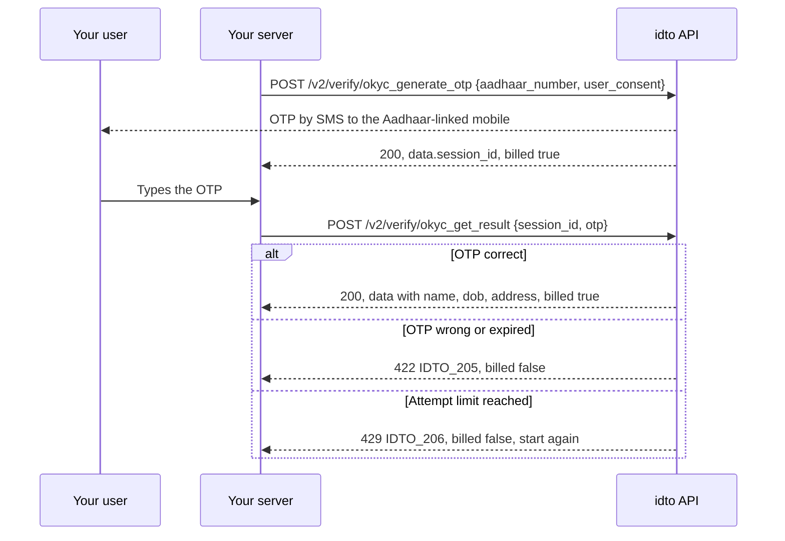
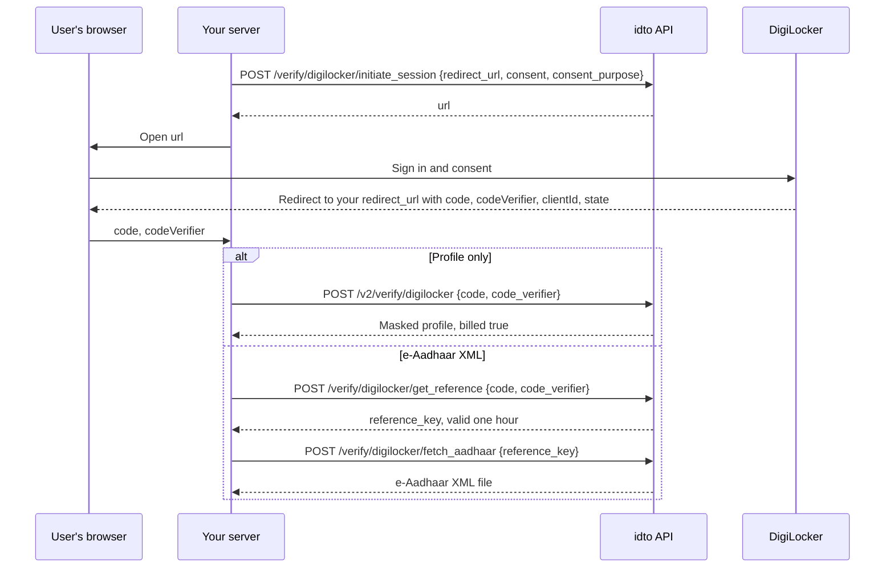

Aadhaar is India's 12-digit national identity number. idto gives you four ways to verify someone with it. Pick by how much assurance you need and what the person has with them.

| Method | The person needs | You get | Assurance |
|---|---|---|---|
| [OKYC](/api-reference/aadhaar/okyc-generate-otp) | Their Aadhaar number and the phone linked to it | Name, date of birth, gender, full address, photo | High: data comes from the Aadhaar record after an OTP |
| [DigiLocker](/api-reference/aadhaar/digilocker) | A DigiLocker sign-in | Profile, and the e-Aadhaar XML on request | High: data comes from DigiLocker after the person consents |
| [Aadhaar QR](/api-reference/aadhaar/aadhaar-qr) | Their card or e-Aadhaar | Name, date of birth, gender, address, photo, and whether the UIDAI signature matched | High for a signed QR that matches, low for an old unsigned QR |
| [Aadhaar OCR](/api-reference/aadhaar/aadhaar-ocr) | A photo of their card | Number, name, date of birth, gender, care-of, address, pincode as printed | Low: reads the card, does not check it |

## Endpoints

| Endpoint | What it does | Billing |
|---|---|---|
| [`POST /v2/verify/okyc_generate_otp`](/api-reference/aadhaar/okyc-generate-otp) | Sends the OTP, returns `session_id` | Billed on 200, including an invalid Aadhaar (`IDTO_202`) |
| [`POST /v2/verify/okyc_get_result`](/api-reference/aadhaar/okyc-get-result) | Checks the OTP, returns the Aadhaar record | Billed only on a correct OTP |
| [`POST /v2/verify/aadhaar_qr`](/api-reference/aadhaar/aadhaar-qr) | Reads the QR and checks its signature | Billed for every readable QR; no QR found (`IDTO_204`) is free |
| [`POST /v2/verify/aadhaar_ocr`](/api-reference/aadhaar/aadhaar-ocr) | Reads the printed card | Billed on 200, including no number read (`IDTO_202`) |
| [`POST /v2/verify/digilocker`](/api-reference/aadhaar/digilocker) | Exchanges the DigiLocker code for a masked profile | Billed only when the profile is returned |
| [`POST /verify/digilocker/initiate_session`](/api-reference/aadhaar/digilocker-initiate-session) | v1. Returns the DigiLocker sign-in URL | Charged when `status` is `success` |
| [`POST /verify/digilocker/get_reference`](/api-reference/aadhaar/digilocker-get-reference) | v1. Exchanges the code for a one-hour `reference_key` | Charged when `status` is `success` |
| [`POST /verify/digilocker/user_details`](/api-reference/aadhaar/digilocker-user-details) | v1. Unmasked DigiLocker profile | Charged when `status` is `success` |
| [`POST /verify/digilocker/fetch_aadhaar`](/api-reference/aadhaar/digilocker-fetch-aadhaar) | v1. e-Aadhaar XML file | Charged when the file is returned |
| [`POST /verify/digilocker/verify_account`](/api-reference/aadhaar/digilocker-verify-account) | v1. Is this mobile registered with DigiLocker? | Charged for both answers |

v2 endpoints return `billed` and support `Idempotency-Key`. v1 endpoints have no idempotency, so a retry can be charged twice.

## OKYC flow

## DigiLocker flow

Each `code` can be exchanged once, so choose one branch per session. To check first whether the user has a DigiLocker account, call [Check a DigiLocker account](/api-reference/aadhaar/digilocker-verify-account) and send new users to sign-up with `redirect_to_signup: true`.

## Outcomes

| Outcome | Endpoint | HTTP | `error_code` | Billed | What to do |
|---|---|---|---|---|---|
| OTP sent | okyc_generate_otp | 200 | `null` | Yes | Ask for the OTP |
| Aadhaar number rejected | okyc_generate_otp | 200 | `IDTO_202` | Yes | Ask the user to check the number |
| OTP generation blocked for now | okyc_generate_otp | 503 | `IDTO_103` | No | Offer DigiLocker or QR instead |
| Verified | okyc_get_result | 200 | `null` | Yes | Compare name and date of birth with what you hold |
| Wrong or expired OTP | okyc_get_result | 422 | `IDTO_205` | No | Let the user retry |
| Too many wrong OTPs | okyc_get_result | 429 | `IDTO_206` | No | Start again from step 1 |
| QR signature matched | aadhaar_qr | 200 | `null`, `authentic: true` | Yes | Accept the card data |
| QR signature did not match | aadhaar_qr | 200 | `null`, `authentic: false` | Yes | Reject the card |
| No QR in the image | aadhaar_qr | 422 | `IDTO_204` | No | Ask for a clearer photo of the QR |
| Card read | aadhaar_ocr | 200 | `null` | Yes | Use as a pre-fill, then verify by OKYC, DigiLocker or QR |
| DigiLocker code expired or reused | digilocker | 400 | `IDTO_001` | No | Start a new DigiLocker session |

## In the idto verification flow

The Aadhaar step in the idto SDKs lets the user choose DigiLocker, an Aadhaar OTP, or an upload (scan the QR or photograph the front and back), with a consent checkbox before they continue.

<video controls preload="metadata" style={{ width: "100%", maxWidth: "390px", borderRadius: "12px" }} src="https://idto-sdk-usage-demo-bucket.s3.ap-south-1.amazonaws.com/docs/v1/video/flow-aadhaar-okyc.mp4" poster="https://idto-sdk-usage-demo-bucket.s3.ap-south-1.amazonaws.com/docs/v1/video/flow-aadhaar-okyc.jpg"></video>

See [SDK modules](/sdks/modules) to add the Aadhaar step to a workflow.

## Next steps

- [Send an Aadhaar OKYC OTP](/recipes/aadhaar-okyc-send-otp)
- [DigiLocker consent flow](/recipes/digilocker-consent-flow)
- [DigiLocker guide](/guides/digilocker-integration)
- [Aadhaar FAQ](/products/aadhaar/faq)

Was this page helpful? [Yes](mailto:tech@idto.ai?subject=Docs%20helpful%3A%20products/aadhaar/overview) / [No](mailto:tech@idto.ai?subject=Docs%20not%20helpful%3A%20products/aadhaar/overview)
