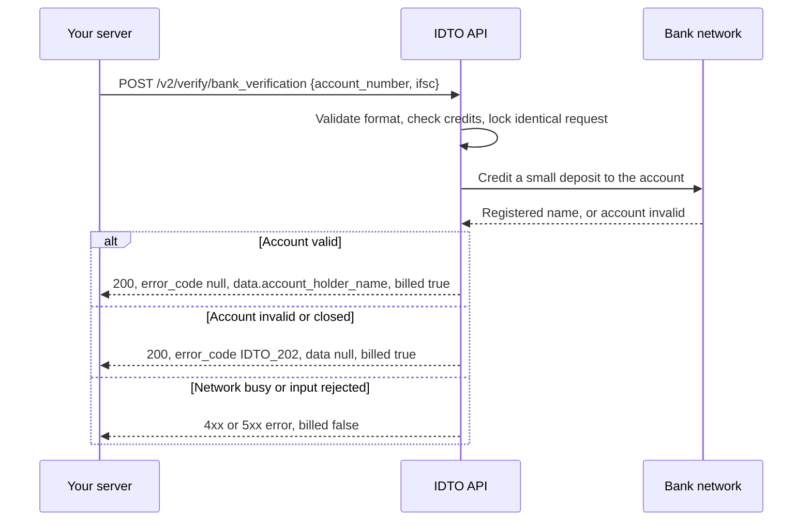

IDTO bank verification confirms that an Indian bank account exists and returns the name the bank holds for it. Use it before you send a payout, refund or loan disbursal, so money only goes to an account that belongs to your user.

## Endpoints

| Endpoint | What it does | Billing |
|---|---|---|
| [`POST /v2/verify/bank_verification`](/api-reference/bank/bank-verification) | Penny drop. Returns a fixed response shape with `account_holder_name`, a masked account number and IFSC. Supports `Idempotency-Key`, and blocks identical concurrent requests automatically. | Billed on every 2xx, including an invalid account (`IDTO_202`). Never billed on an error. |
| [`POST /verify/bank_verification/pennyless`](/api-reference/bank/bank-verification-pennyless) | v1. Checks the account without a deposit. Response fields are passed through as the bank network returns them. No idempotency. | Charged only when `status` is `success`. |

Start with `/v2/verify/bank_verification` for new integrations.

## How a penny drop works

## Outcomes

| Outcome | HTTP | `error_code` | Billed | What to do |
|---|---|---|---|---|
| Account valid | 200 | `null` | Yes | Compare `data.account_holder_name` with the name you hold, then pay out. |
| Account invalid, closed or not found | 200 | `IDTO_202` | Yes | Ask the user for a different account. |
| Input malformed | 400 or 422 | `IDTO_001`, `IDTO_401`, `IDTO_402` | No | Fix the account number or IFSC. |
| Duplicate request still running | 409 | `IDTO_004` | No | Wait for the first response. |
| Network busy | 503 | `IDTO_008`, `IDTO_103`, `IDTO_403` | No | Retry with backoff and an `Idempotency-Key`. |

## In the IDTO verification flow

The bank step in the IDTO SDKs collects the account number (entered twice) and IFSC from your user, verifies the account and shows the registered name.

<video controls muted playsInline src="https://idto-sdk-bucket.s3.ap-south-1.amazonaws.com/docs/v1/video/flow-bank.mp4"></video>

<CardGroup cols={2}>
  <Card title="Account details entry">
    
  </Card>
  <Card title="Verified result">
    
  </Card>
</CardGroup>

See [SDK modules](/sdks/modules) to add the bank step to a workflow.

## Next steps

- [Retry safely with an idempotency key](/recipes/pan-ocr-idempotent-retry)
- [Idempotency](/concepts/idempotency)
- [Bank FAQ](/products/bank/faq)

Was this page helpful? [Yes](mailto:tech@idto.ai?subject=Docs%20helpful%3A%20products%2Fbank%2Foverview) / [No](mailto:tech@idto.ai?subject=Docs%20not%20helpful%3A%20products%2Fbank%2Foverview)
