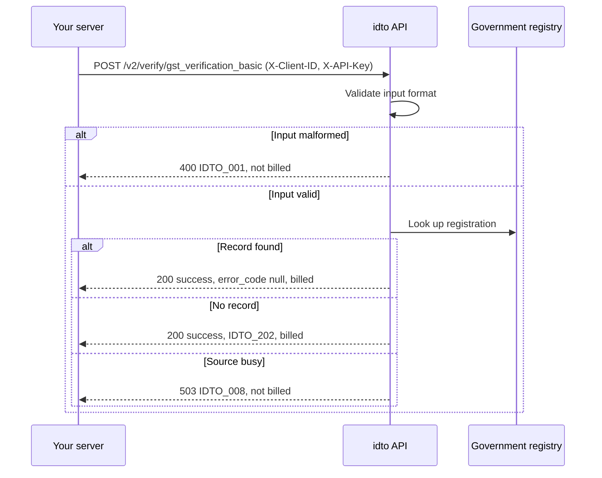

Business verification covers know-your-business and employment checks: confirm a GSTIN, read a company's registry record, and fetch a person's EPFO employment history.

<video controls preload="metadata" src="https://idto-sdk-usage-demo-bucket.s3.ap-south-1.amazonaws.com/docs/v1/video/flow-kyb.mp4" poster="https://idto-sdk-usage-demo-bucket.s3.ap-south-1.amazonaws.com/docs/v1/video/flow-kyb.jpg" style={{ width: "100%", maxWidth: "390px", borderRadius: "12px" }}></video>

## Endpoints

| Product | Endpoint | Input | Use it to |
|---|---|---|---|
| [GST basic](/api-reference/business/gst-verification-basic) | `POST /v2/verify/gst_verification_basic` | GSTIN | Confirm a GST registration and read the business name and status |
| [GST advanced](/api-reference/business/gst-advance) | `POST /verify/gst_advance` | GSTIN | Read filing history, goods and services and places of business |
| [CIN](/api-reference/business/cin-mca-verification) | `POST /v2/verify/cin_mca_verification` | CIN or LLPIN | Confirm a company is registered and active, and list directors |
| [Employment history](/api-reference/business/employment-history) | `POST /v2/verify/employment_history` | UAN | Confirm current and past employers |
| [GST basic (v1)](/api-reference/business/gst-verification-basic-v1) | `POST /verify/gst_verification_basic` | GSTIN | GST basic on the v1 contract |
| [GST with filing status (v1)](/api-reference/business/gst-verification) | `POST /verify/gst_verification` | GSTIN | Read registration details with return filing history |
| [CIN (v1)](/api-reference/business/cin-mca-verification-v1) | `POST /verify/cin_mca_verification` | CIN or LLPIN | Company registry check on the v1 contract |
| [Business PAN (v1)](/api-reference/business/business-pan) | `POST /verify/business_pan` | PAN | Read the organisation and director behind a business PAN |
| [PAN to GST (v1)](/api-reference/business/pan-to-gst) | `POST /verify/pan_to_gst` | PAN | List the GSTINs issued against a PAN |
| [PAN to CIN (v1)](/api-reference/business/pan-to-cin) | `POST /verify/pan_to_cin` | Company PAN | Find a company's CIN |
| [PAN to DIN (v1)](/api-reference/business/pan-to-din) | `POST /verify/pan_to_din` | Individual PAN | Find a director's DIN |
| [Udyam (v1)](/api-reference/business/verify-udyam) | `POST /verify/verify_udyam` | Udyam number | Confirm an MSME registration |
| [Shop and establishment (v1)](/api-reference/business/shop-establishment-verification) | `POST /verify/shop_establishment_verification` | Registration number and area code | Confirm a shop and establishment registration |
| [PAN to UAN (v1)](/api-reference/business/pan-to-uan) | `POST /verify/pan_to_uan` | PAN | Find a person's UAN |
| [Mobile to UAN (v1)](/api-reference/business/mobile-to-uan) | `POST /verify/mobile_to_uan` | Mobile number | Find a person's UAN |
| [UAN verification (v1)](/api-reference/business/uan-verification) | `POST /verify/uan_verification` | UAN | Check current employment and the latest employer |
| [PF passbook (v1)](/api-reference/business/pf-employee-passbook) | `POST /verify/pf_employee_passbook` | UAN or PAN | Read EPF contributions and balance |
| [Employment history (v1)](/api-reference/business/employment-history-v1) | `POST /verify/employment_history` | UAN | Employment history on the v1 contract |

## How a call works

## Outcomes and billing

| Outcome | v2 products | GST advanced |
|---|---|---|
| Record found | 200, `error_code: null`, billed | 200, `status: "success"`, charged |
| No record | 200, `error_code: "IDTO_202"`, `data: null`, billed | 404, not charged |
| Bad input | 400 or 422 `IDTO_001`, not billed | 400 or 422, not charged |
| Source busy or rate limited | 503 `IDTO_008` or 429 `IDTO_006`, not billed | Error status, not charged |

Every v2 response carries a boolean `billed`. Send an `Idempotency-Key` on v2 calls so a network retry is never billed twice; GST advanced has no idempotency support. On staging, the v1 employment history and PF passbook endpoints can answer `202` with `IDTO_203` and a `reference_id`; see [Environments](/environments#what-differs-between-environments). Error bodies follow [Error response shapes](/concepts/request-response#error-response-shapes), and charges follow the [billing rule](/concepts/billing-consent#billing).

## In a verification flow

GST and company checks are available as steps in an idto workflow, so your customer enters their GSTIN or CIN in the hosted flow and you receive the result with the session. The recording above shows that step. See the [FAQ](/products/business/faq) for common questions.

---

Was this page helpful? Email us at [tech@idto.ai](mailto:tech@idto.ai?subject=Docs%20feedback%3A%20Business%20verification) with the page link.
