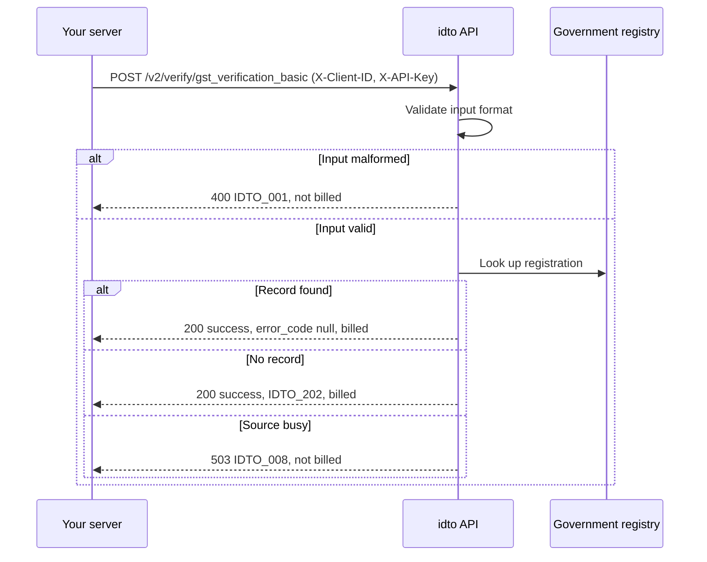

Business verification covers know-your-business and employment checks: confirm a GSTIN, read a company's registry record, and fetch a person's EPFO employment history.

<video controls preload="metadata" src="https://idto-sdk-usage-demo-bucket.s3.ap-south-1.amazonaws.com/docs/v1/video/flow-kyb.mp4" poster="https://idto-sdk-usage-demo-bucket.s3.ap-south-1.amazonaws.com/docs/v1/video/flow-kyb.jpg" style={{ width: "100%", maxWidth: "390px", borderRadius: "12px" }}></video>

## Endpoints

| Product | Endpoint | Input | Use it to |
|---|---|---|---|
| [GST basic](/api-reference/business/gst-verification-basic) | `POST /v2/verify/gst_verification_basic` | GSTIN | Confirm a GST registration and read the business name and status |
| [GST advanced](/api-reference/business/gst-advance) | `POST /verify/gst_advance` | GSTIN | Read filing history, goods and services and places of business |
| [CIN](/api-reference/business/cin-mca-verification) | `POST /v2/verify/cin_mca_verification` | CIN or LLPIN | Confirm a company is registered and active, and list directors |
| [Employment history](/api-reference/business/employment-history) | `POST /v2/verify/employment_history` | UAN | Confirm current and past employers |

## How a call works

## Outcomes and billing

| Outcome | v2 products | GST advanced |
|---|---|---|
| Record found | 200, `error_code: null`, billed | 200, `status: "success"`, charged |
| No record | 200, `error_code: "IDTO_202"`, `data: null`, billed | 404, not charged |
| Bad input | 400 or 422 `IDTO_001`, not billed | 400 or 422, not charged |
| Source busy or rate limited | 503 `IDTO_008` or 429 `IDTO_006`, not billed | Error status, not charged |

Every v2 response carries a boolean `billed`. Send an `Idempotency-Key` on v2 calls so a network retry is never billed twice; GST advanced has no idempotency support.

## In a verification flow

GST and company checks are available as steps in an idto workflow, so your customer enters their GSTIN or CIN in the hosted flow and you receive the result with the session. The recording above shows that step. See the [FAQ](/products/business/faq) for common questions.

---

Was this page helpful? [Yes](mailto:tech@idto.ai?subject=Docs%20helpful%3A%20products%2Fbusiness%2Foverview) / [No](mailto:tech@idto.ai?subject=Docs%20not%20helpful%3A%20products%2Fbusiness%2Foverview)
