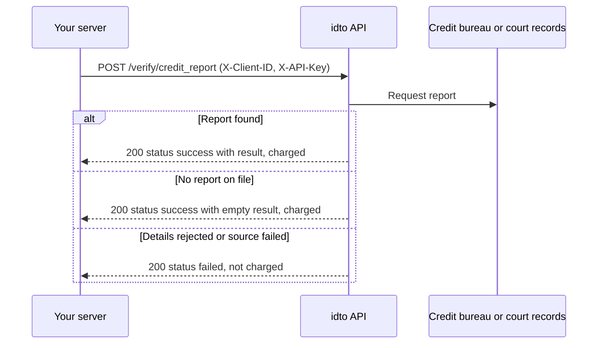

Credit and legal checks help you assess risk before you lend or contract: pull an individual's credit report, and search court records for cases filed against a person.

## Endpoints

| Product | Endpoint | Input | Use it to |
|---|---|---|---|
| [Credit report](/api-reference/credit-legal/credit-report) | `POST /verify/credit_report` | Name, mobile, PAN | Read a borrower's credit history |
| [Court check](/api-reference/credit-legal/court-check) | `POST /verify/court_check` | Name, address, optional father's name | Find cases filed against a person |

<Warning>
Neither endpoint supports idempotency. A retried request runs again and can be charged again.
</Warning>

## How a call works

## Outcomes and billing

| Outcome | Credit report | Court check |
|---|---|---|
| Data found | 200, `status: "success"`, charged | 200, matches in `strong_match` or `possible_match`, charged |
| Nothing on file | 200, `status: "success"`, empty `result`, charged | 200, empty lists, charged |
| Rejected or failed | 200 `status: "failed"`, or 502/504, not charged | Error status, not charged |
| Bad input | 422, not charged | 422, not charged |

A charged call carries `"chargeble": "true"`. Error bodies follow [Error response shapes](/concepts/request-response#error-response-shapes), and charges follow the [billing rule](/concepts/billing-consent#billing). See the [FAQ](/products/credit-legal/faq) for common questions.

---

Was this page helpful? Email us at [tech@idto.ai](mailto:tech@idto.ai?subject=Docs%20feedback%3A%20Credit%20and%20legal%20checks) with the page link.
