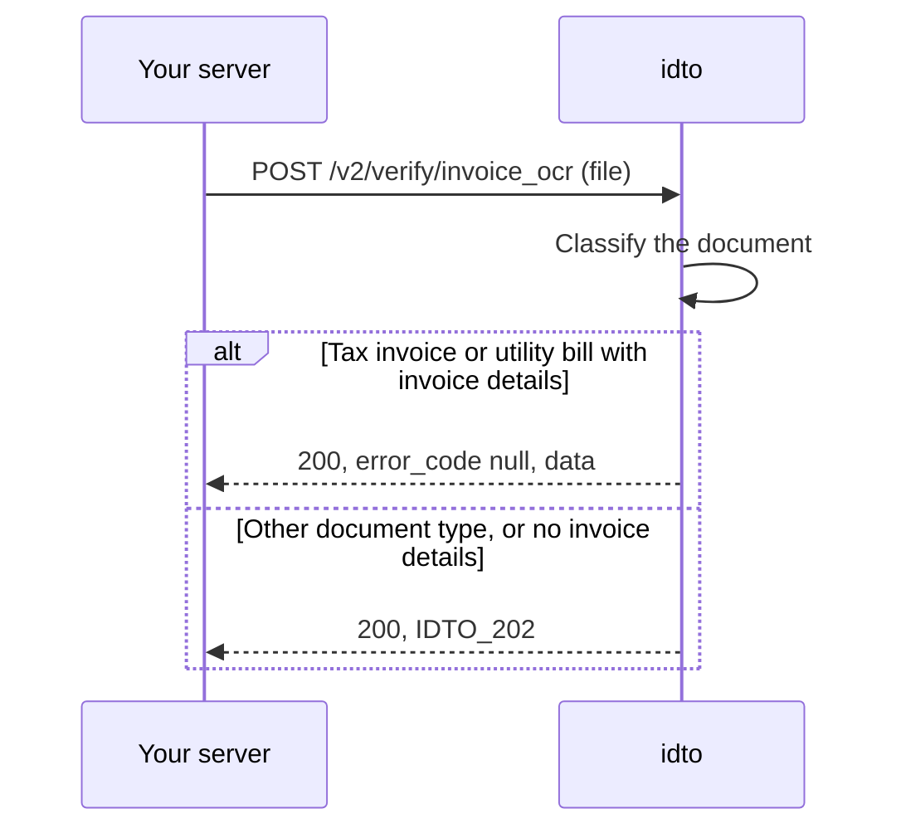

Use this module to turn an invoice or bill into data, or to read and check other identity documents on v1. idto classifies the upload, accepts tax invoices and utility bills, and returns the parties, GSTINs, line items, tax totals and printed bank details.

## Endpoints

| Endpoint | What it does | Billed when |
|---|---|---|
| [Invoice OCR](/api-reference/documents/invoice-ocr) `POST /v2/verify/invoice_ocr` | Reads a tax invoice or utility bill into structured fields. | Every 2xx, including `IDTO_202` |
| [Invoice OCR (v1)](/api-reference/documents/invoice-ocr-v1) `POST /verify/invoice_ocr` | v1. Same fields as Invoice OCR, no idempotency. | `status` is `success`, including `IDTO_202` |
| [Document OCR (v1)](/api-reference/documents/ocr) `POST /verify/ocr` | v1. Reads a PAN, driving licence, Aadhaar, voter ID or passport image. | `status` is `success` |
| [Voter ID (v1)](/api-reference/documents/voter-verification) `POST /verify/voter_verification` | v1. Looks up a voter ID on the electoral roll. | `status` is `success` |
| [Passport (v1)](/api-reference/documents/passport) `POST /verify/passport` | v1. Looks up a passport application by file number and date of birth. | `status` is `success` |

## How an upload is processed

## Outcomes and billing

`error_code: null` with `data` means the document was accepted and read. `IDTO_202` means it was read but is not an accepted type or has no invoice details; when the type is the reason, `data.document_type` tells you what was uploaded. Both are 2xx and billed. Errors such as a file over 12 MB (`IDTO_503`, 413) are never billed. Error bodies follow [Error response shapes](/concepts/request-response#error-response-shapes), and charges follow the [billing rule](/concepts/billing-consent#billing).

Every value is what is printed on the document. To confirm a GSTIN or a bank account found on an invoice, call the matching verification endpoint.

## Test scenarios

| Input | Expected | Billed |
|---|---|---|
| GST tax invoice | 200, `error_code: null`, `document_type: TAX_INVOICE` | Yes |
| Electricity bill | 200, `error_code: null`, `document_type: UTILITY_BILL` | Yes |
| Bank statement | 200, `IDTO_202`, `document_type: BANK_STATEMENT` | Yes |
| File over 12 MB | 413, `IDTO_503` | No |

Common questions: [FAQ](/products/documents/faq).

---

Was this page helpful? Email us at [tech@idto.ai](mailto:tech@idto.ai?subject=Docs%20feedback%3A%20Documents) with the page link.
