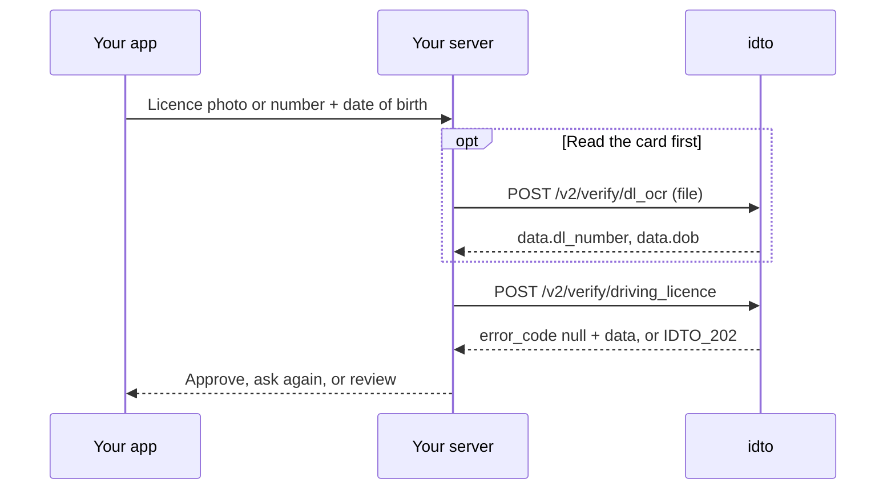

Use this module to onboard drivers, delivery partners and vehicle owners. Verify that a licence is real and valid, pull the details off a licence photo, and confirm a vehicle's registration, insurance and tax status.

## Endpoints

| Endpoint | What it does | Billed when |
|---|---|---|
| [Verify a driving licence](/api-reference/driving-vehicle/driving-licence) `POST /v2/verify/driving_licence` | Checks licence number and date of birth with the issuer and returns holder details, validity and vehicle classes. | Every 2xx, including `IDTO_202` (no record) |
| [Driving licence OCR](/api-reference/driving-vehicle/dl-ocr) `POST /v2/verify/dl_ocr` | Reads the fields printed on a licence image. | Every 2xx, including `IDTO_202` (nothing readable) |
| [Vehicle RC](/api-reference/driving-vehicle/vehicle-rc) `POST /verify/vehicle_rc` | Returns the registration record for a vehicle number. v1 contract. | Only when `status` is `success` |
| [Driving licence (v1)](/api-reference/driving-vehicle/driving-licence-v1) `POST /verify/driving_licence` | v1 contract. Checks licence number and date of birth with the issuer. | Only when `status` is `success` |
| [Vehicle RC plus](/api-reference/driving-vehicle/vehicle-rc-plus) `POST /verify/vehicle_rc_plus` | Registration record with permit, blacklist and challan details. v1 contract. | Only when `status` is `success` |
| [Vehicle challan](/api-reference/driving-vehicle/vehicle-challan) `POST /verify/vehicle_challan` | Traffic e-challans recorded against a vehicle number. v1 contract. | Only when `status` is `success` |
| [FASTag toll history](/api-reference/driving-vehicle/fastag-toll-history) `POST /verify/fastag_toll_history` | Recent toll plaza crossings on a vehicle's FASTag. v1 contract. | Only when `status` is `success` |
| [FASTag verification](/api-reference/driving-vehicle/fast-tag-verification) `POST /verify/fast_tag_verification` | FASTag details on record for a vehicle number. v1 contract. | Only when `status` is `success` |

## How a licence check works

## Outcomes and billing

The two v2 endpoints share the idto envelope. `error_code: null` means a record or a reading was returned; `IDTO_202` means the check ran and found nothing. Both are 2xx and billed. Every non-2xx response is an error and is never billed. Vehicle RC is a v1 endpoint: it is charged only when `status` is `success`, and the charge is marked by `chargeble: "true"`.

## In the hosted flow

The driving licence step of the idto verification flow collects the licence details from the user and shows the verified result.

<video controls muted playsInline src="https://idto-sdk-usage-demo-bucket.s3.ap-south-1.amazonaws.com/docs/v1/video/flow-driving-licence.mp4" poster="https://idto-sdk-usage-demo-bucket.s3.ap-south-1.amazonaws.com/docs/v1/video/flow-driving-licence.jpg" aria-label="Driving licence step in the idto verification flow"></video>

<Frame>
  
</Frame>

## Test scenarios

| Endpoint | Input | Expected | Billed |
|---|---|---|---|
| Driving licence | Valid number with matching date of birth | 200, `error_code: null` | Yes |
| Driving licence | Well-formed number with no record | 200, `IDTO_202` | Yes |
| Driving licence | `dob` in an unsupported format | 400, `IDTO_001` | No |
| Driving licence OCR | Photo that is not a licence | 200, `IDTO_202` | Yes |
| Driving licence OCR | File over 12 MB | 413, `IDTO_503` | No |
| Vehicle RC | Body without `vehicle_number` | 422 | No |

Each endpoint page lists its full set. Common questions: [FAQ](/products/driving-vehicle/faq).

---

Was this page helpful? Email us at [tech@idto.ai](mailto:tech@idto.ai?subject=Docs%20feedback%3A%20Driving%20licence%20and%20vehicle) with the page link.
