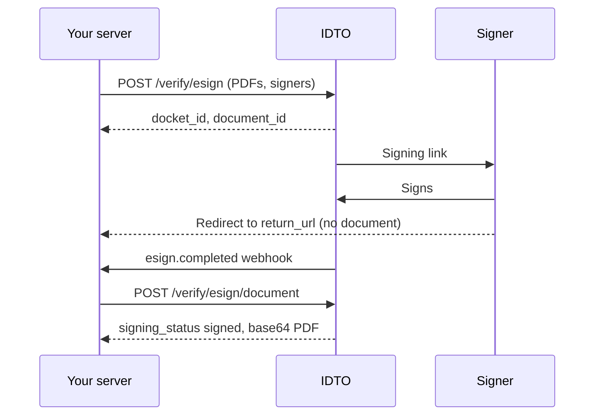

eSign sends one or more PDFs to the people who must sign them, collects their signatures (Aadhaar-based or electronic, as you set per signer), and gives you the signed PDF back through the IDTO API. IDTO archives every signed PDF as soon as signing completes, so you can download it later.

## How it works

## Endpoints

| Endpoint | Purpose | Billed |
|---|---|---|
| [`POST /verify/esign`](/api-reference/esign/esign) | Create a docket | When `status` is `success` |
| [`POST /verify/esign/document`](/api-reference/esign/esign-document) | Signing status and signed PDF | Never |
| [esign.completed webhook](/api-reference/webhooks/esign-completed) | Signing finished | Not applicable |

## Outcomes

| Situation | What you get |
|---|---|
| Docket created | 200, `status: success`, `docket_id`, charged |
| Signing in progress | `signing_status: pending`, `content: null` |
| All signers signed | `signing_status: signed`, base64 PDF in `content`, plus one webhook |
| Signed copy deleted upstream before archiving | 410; contact support |

## Test scenarios

| Input | Expected | Billed |
|---|---|---|
| Valid body, one signer, preset placement | 200, `status: success` | Yes |
| PDF larger than 10 MB | 422 | No |
| `appearance` set to `bottom` | 422 | No |
| Fetch right after creating | 200, `signing_status: pending` | No |
| Fetch after all signers signed | 200, `signing_status: signed` | No |
| Fetch with a `docket_id` from another account | 404 | No |

eSign is available through the API. The eSign step in the hosted verification flow is not yet available, so there is no flow recording for it.

Next: [eSign workflow guide](/guides/esign-workflow), [eSign FAQ](/products/esign/faq).

---

Was this page helpful? [Yes](mailto:tech@idto.ai?subject=Docs%20helpful%3A%20products/esign/overview) / [No](mailto:tech@idto.ai?subject=Docs%20not%20helpful%3A%20products/esign/overview)
