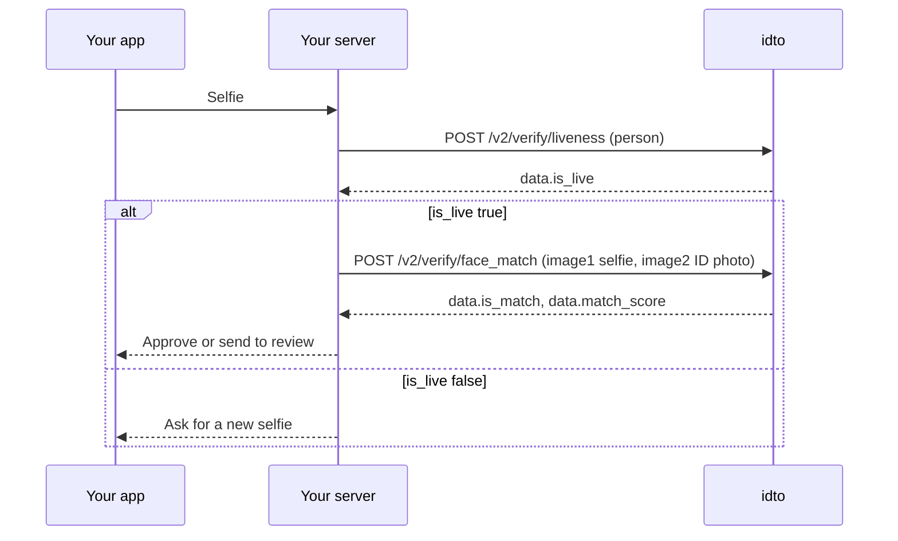

Use this module to bind a person to an identity document. Liveness confirms that the selfie was taken of a real person in front of the camera. Face match then compares that selfie with the photo on the ID.

## Endpoints

| Endpoint | What it does | Billed when |
|---|---|---|
| [Liveness](/api-reference/face/liveness) `POST /v2/verify/liveness` | Checks one base64 selfie for presentation attacks and capture problems. | Every 2xx, including `is_live: false` |
| [Face match](/api-reference/face/face-match) `POST /v2/verify/face_match` | Compares two faces and returns a 0 to 100 score and a match decision. | Every 2xx, including `is_match: false` |
| [Liveness (v1)](/api-reference/face/liveness-v1) `POST /verify/liveness` | v1 contract. Checks one base64 selfie. No idempotency. | Only when `status` is `success` |
| [Face match (v1)](/api-reference/face/face-match-v1) `POST /verify/face_match` | v1 contract. Compares a selfie with a document photo. No idempotency. | Only when `status` is `success` |

## How a selfie check works

## Outcomes and billing

Both endpoints return the idto envelope. A 2xx response is billed whatever the decision: a failed liveness check or a non-matching face is still a completed check. Errors such as an unreadable image (`IDTO_503`, 413) or no decision (`IDTO_509` or `IDTO_609`, 500) are never billed. Face match treats a score of 70 or more as a match.

## In the hosted flow

The face step of the idto verification flow guides the user through the selfie capture.

<video controls muted playsInline src="https://idto-sdk-usage-demo-bucket.s3.ap-south-1.amazonaws.com/docs/v1/video/flow-face.mp4" poster="https://idto-sdk-usage-demo-bucket.s3.ap-south-1.amazonaws.com/docs/v1/video/flow-face.jpg" aria-label="Face capture step in the idto verification flow"></video>

<Frame>
  
</Frame>

## Test scenarios

| Endpoint | Input | Expected | Billed |
|---|---|---|---|
| Liveness | Clear selfie of a live person | 200, `is_live: true` | Yes |
| Liveness | Base64 that is not an image | 413, `IDTO_503` | No |
| Face match | Two photos of the same person | 200, `is_match: true` | Yes |
| Face match | Photos of two different people | 200, `is_match: false` | Yes |
| Face match | Neither `image2` nor `image2_url` | 400, `IDTO_001` | No |

Each endpoint page lists its full set. Common questions: [FAQ](/products/face/faq).

---

Was this page helpful? Email us at [tech@idto.ai](mailto:tech@idto.ai?subject=Docs%20feedback%3A%20Face%20and%20liveness) with the page link.
