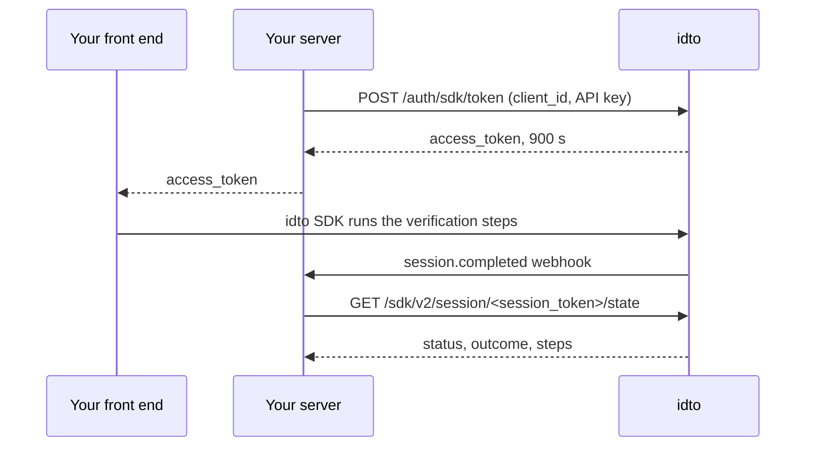

Integration endpoints connect your server to the idto verification flow. Your server mints a short-lived SDK token, your front end opens the flow with it, and your server learns the result from the session completed webhook or by reading the session state. None of these calls are billed; the verifications inside the flow are.

## How it works

<Frame>
  
</Frame>

## Endpoints

| Endpoint | Auth | Purpose |
|---|---|---|
| [`POST /auth/sdk/token`](/api-reference/integration/sdk-token) | Client ID and API key in the body | Mint a 15 minute token |
| [`GET /sdk/v2/session/{session_token}/state`](/api-reference/integration/session-state) | `Authorization: Bearer <SDK token>` | Read status and verdict |
| [`POST /merchant/verification-links`](/api-reference/integration/verification-links-create) | `Authorization: Bearer <dashboard login token>` | Create a shareable link that runs a workflow |
| [`GET /merchant/verification-links`](/api-reference/integration/verification-links-list) | `Authorization: Bearer <dashboard login token>` | List links with status and runs left |
| [`DELETE /merchant/verification-links/{link_id}`](/api-reference/integration/verification-links-revoke) | `Authorization: Bearer <dashboard login token>` | Revoke a link |
| [`POST /verify/name_match`](/api-reference/integration/name-match) | `X-Client-ID` and `X-API-Key` | Score how closely two names match (v1, charged only when `status` is `success`) |
| [session.completed webhook](/api-reference/webhooks/session-completed) | Signed with your webhook secret | Push on completion |

## Outcomes

| `status` | `outcome` | Meaning |
|---|---|---|
| `in_progress` | `null` | The user is still in the flow |
| `completed` | `verified` | All checks passed |
| `completed` | `needs_review` | A soft flag was raised, such as a low name match |
| `completed` | `not_verified` | A check failed |
| `abandoned` | `null` | The session was abandoned |

Error bodies follow [Error response shapes](/concepts/request-response#error-response-shapes), and charges follow the [billing rule](/concepts/billing-consent#billing).

## Test scenarios

| Input | Expected | Billed |
|---|---|---|
| Correct client ID and API key | 200 with `access_token` | No |
| Wrong API key | 401 `Invalid client credentials` | No |
| Session state with a token older than 15 minutes | 401 `SDK session token expired` | No |
| Session state for another account's session | 403 | No |
| Session state for an unknown `session_token` | 404 | No |

Next: [SDK guides](/sdks/web), [Webhooks](/concepts/webhooks), [Integration FAQ](/products/integration/faq).

---

Was this page helpful? Email us at [tech@idto.ai](mailto:tech@idto.ai?subject=Docs%20feedback%3A%20Integration%20overview) with the page link.
