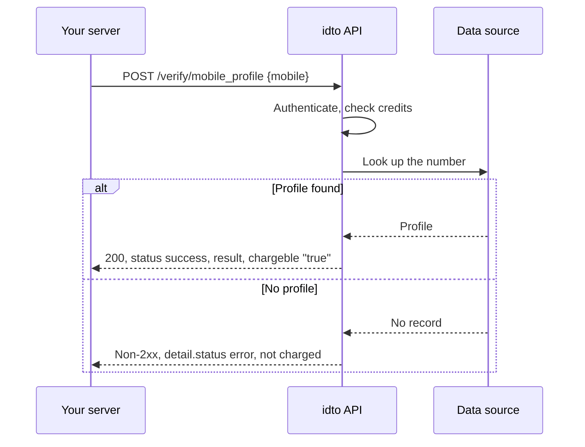

idto mobile verification covers two jobs. From your server, the mobile profile API returns the profile linked to a mobile number. Inside the idto SDK flow, the mobile step confirms your user owns the number by OTP before the rest of the workflow runs.

## Endpoints

| Endpoint | What it does | Billing |
|---|---|---|
| [`POST /verify/mobile_profile`](/api-reference/mobile/mobile-profile) | v1. Returns the profile linked to a 10-digit mobile number in a `result` object. No idempotency. | Charged only when `status` is `success`. No record found is a non-2xx error and is not charged. |

## How a profile lookup works

## Outcomes

| Outcome | HTTP | Charged | What to do |
|---|---|---|---|
| Profile found | 200, `status: "success"` | Yes | Use `result` to pre-fill or cross-check what the user entered. |
| No profile for the number | Non-2xx, `{"detail": {...}}` | No | Continue onboarding without pre-fill, or ask for another number. |
| `mobile` missing or empty | 422 or 400 | No | Fix the request. |
| Not enough credits | 400 | No | Recharge your balance. |

<Warning>
`/verify/mobile_profile` has no idempotency support. A retry after a timeout runs the lookup again and can be charged twice.
</Warning>

## In the idto verification flow

The mobile step in the idto SDKs sends a 6-digit OTP to your user's number and verifies it before the next step starts.

<video controls muted playsInline src="https://idto-sdk-usage-demo-bucket.s3.ap-south-1.amazonaws.com/docs/v1/video/flow-mobile.mp4" poster="https://idto-sdk-usage-demo-bucket.s3.ap-south-1.amazonaws.com/docs/v1/video/flow-mobile.jpg"></video>

See [SDK modules](/sdks/modules) to add the mobile step to a workflow.

## Next steps

- [Mobile profile API reference](/api-reference/mobile/mobile-profile)
- [Mobile FAQ](/products/mobile/faq)

Was this page helpful? [Yes](mailto:tech@idto.ai?subject=Docs%20helpful%3A%20products%2Fmobile%2Foverview) / [No](mailto:tech@idto.ai?subject=Docs%20not%20helpful%3A%20products%2Fmobile%2Foverview)
