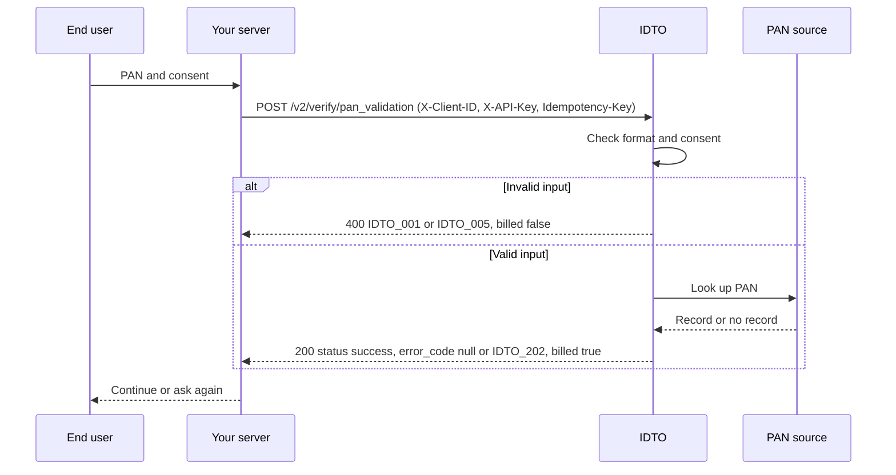

PAN is the starting point of most Indian KYC flows. IDTO gives you four ways to work with it, from a quick existence check to a full record lookup, plus OCR to prefill the number from a photo of the card.

<video
  controls
  src="https://idto-sdk-bucket.s3.ap-south-1.amazonaws.com/docs/v1/video/flow-pan.mp4"
></video>

The recording shows the PAN step in the IDTO web SDK, using sample data.

## Which endpoint to use

| You want to | Endpoint | Version |
|---|---|---|
| Confirm a PAN exists and is active, get the name and holder category | [`POST /v2/verify/pan_validation`](/api-reference/pan/pan-validation) | v2 |
| Get the full record: address, masked Aadhaar, masked contacts, gender, DOB, bank accounts | [`POST /v2/verify/pan_detailed`](/api-reference/pan/pan-detailed) | v2 |
| Read the PAN number, name, father's name and DOB from a card image | [`POST /v2/verify/pan_ocr`](/api-reference/pan/pan-ocr) | v2 |
| Check whether a name and DOB you hold match the PAN record | [`POST /verify/pan_nsdl`](/api-reference/pan/pan-nsdl) | v1 |
| Full record on the older v1 contract | [`POST /verify/pan_all_in_one`](/api-reference/pan/pan-all-in-one) | v1 |

A common pattern is OCR first to prefill, then validation on the number the user confirms.

## How a v2 PAN check works

## Outcomes and billing

| Outcome | HTTP | `status` | `error_code` | Billed |
|---|---|---|---|---|
| Record found or card read | 200 | `success` | `null` | Yes |
| No record, or no PAN readable on the card | 200 | `success` | `IDTO_202` | Yes |
| Bad input, missing consent, auth, rate limit or service error | 4xx or 5xx | `error` | `IDTO_0xx` or `IDTO_503` | No |

Every v2 response carries a boolean `billed`. On the v1 endpoints a call is charged only when `status` is `success`; there `chargeble` and `user_consent` are `"true"` on a charged call. See [Billing and consent](/concepts/billing-consent).

## In the SDK

The PAN step in the IDTO SDKs handles capture and shows the result to the user. See [SDKs](/sdks/web) to embed it.

<CardGroup cols={2}>
  <Card title="Card capture">
    
  </Card>
  <Card title="Verified result">
    
  </Card>
</CardGroup>

## Next steps

- [Verify a PAN and branch on error_code](/recipes/verify-pan-branch-on-error-code)
- [PAN FAQ](/products/pan/faq)
- [Input formats](/reference/input-formats)

Was this page helpful? [Yes](mailto:tech@idto.ai?subject=Docs%20helpful%3A%20products/pan/overview) / [No](mailto:tech@idto.ai?subject=Docs%20not%20helpful%3A%20products/pan/overview)
